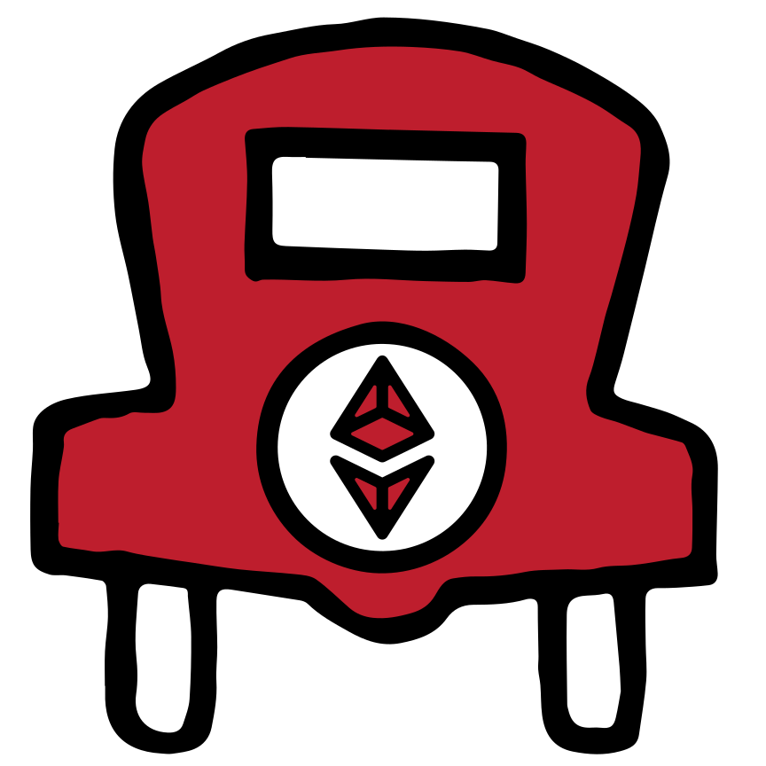

#### DO NOT USE ETHERPARKING LOGO WITHOUT OUR CONSENT.  在我们的准许之前请勿使用我们ETHERPARKING的LOGO НЕ ИСПОЛЬЗУЙТЕ ЛОГОТИП ETHERPARKING БЕЗ НАШЕГО СОГЛАСИЯ. NO UTILICE ETHERPARKING LOGO SIN NUESTRO CONSENTIMIENTO.

# Ether Parking Protocol Brand Assets (rev. 1)
An proportional Ether distribution system represented by token shares.
# Contact
For commerical usage please contact team.etherparking@top-email.net  
For additonal media inquiries please contact marketing.etherparking@top-email.net  
For non-commercial usage please notify us on [Matrix](https://matrix.to/#/!IkFxaTkNGWQmHHSuMy:matrix.org?via=matrix.org).

## Token Logo
 
For token logo please use [etherparking.svg](etherparking.svg)  

### Progressive Web Apps
 
For PWA's use [android-chrome-192x192.png](android-chrome-192x192.png) or [android-chrome-512x512.png](android-chrome-512x512.png) 

### Favicons
 
For favicons use use [favicon.ico](favicon.ico), [favicon-16x16.png](favicon-16x16.png) or [favicon-32x32.png](favicon-32x32.png) 

# Contents
<li>android-chrome-192x192.png</li>
<li>android-chrome-512x512.png</li>
<li>etherparking.svg</li>
<li>favicon-16x16.png</li>
<li>favicon-32x32.png</li>
<li>favicon.ico</li>
<li>mstile-150x150.png</li>
<li>safari-pinned-tab.svg</li>
